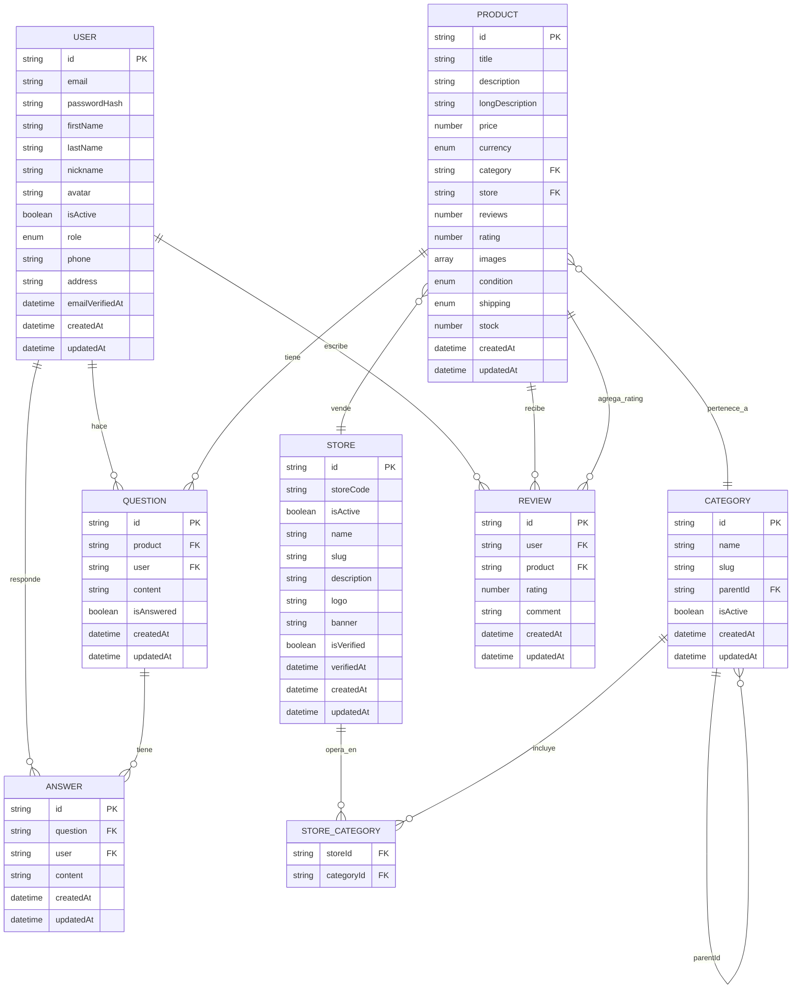

# Diagrama Entidad-Relación (DER) - API MercadoLibre

## Diagrama del Sistema

## Explicación de las Relaciones

### Relaciones 1:N (Uno a Muchos)
- **USER → QUESTION**: Un usuario puede hacer múltiples preguntas
- **USER → ANSWER**: Un usuario puede responder múltiples preguntas
- **USER → REVIEW**: Un usuario puede escribir múltiples reseñas
- **PRODUCT → QUESTION**: Un producto puede tener múltiples preguntas
- **PRODUCT → REVIEW**: Un producto puede recibir múltiples reseñas
- **QUESTION → ANSWER**: Una pregunta puede tener múltiples respuestas
- **CATEGORY → CATEGORY**: Categorías pueden tener subcategorías (jerarquía)
- **CATEGORY → PRODUCT**: Una categoría puede contener múltiples productos
- **STORE → PRODUCT**: Una tienda puede vender múltiples productos

### Relaciones 1:1 (Uno a Uno)
- **PRODUCT → CATEGORY**: Un producto pertenece a una sola categoría
- **PRODUCT → STORE**: Un producto pertenece a una sola tienda

## Tipos de Datos y Enums

### Enums Utilizados:
- **USER.role**: `customer`, `admin`, `moderator`
- **PRODUCT.currency**: `ARS`, `USD`, `EUR`, `BRL`, `MXN`
- **PRODUCT.condition**: `new`, `used`
- **PRODUCT.shipping**: `free`, `standard`, `premium`

### Campos Especiales:
- **Soft References**: Los campos FK pueden contener tanto IDs (string) como objetos completos (Populados)
- **Timestamps**: Todas las entidades tienen `createdAt` y `updatedAt`
- **Arrays**: PRODUCT.images, PRODUCT.questions

## Patrones de Población (Populate)

El sistema permite poblar las siguientes relaciones:
- **PRODUCTS**: Categories, Stores, Questions
- **REVIEWS**: Users, Products
- **QUESTIONS**: Users, Answers
- **STORES**: Categories
- **ANSWERS**: Users

## Flujo de Datos Principal

1. **Usuarios** se registran en el sistema
2. **Tiendas** se crean y se asocian a categorías
3. **Productos** se crean asociados a tiendas y categorías
4. **Usuarios** hacen preguntas sobre productos
5. **Usuarios** responden preguntas
6. **Usuarios** escriben reseñas de productos
7. **Sistema** calcula ratings promedio de productos basado en reseñas
